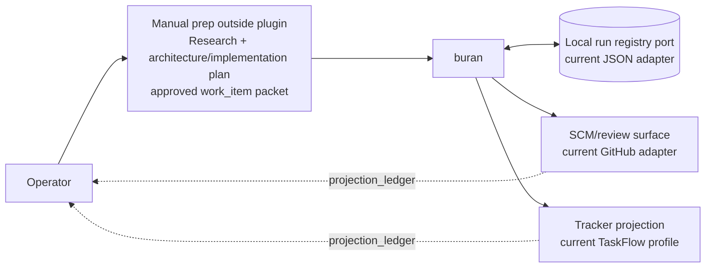
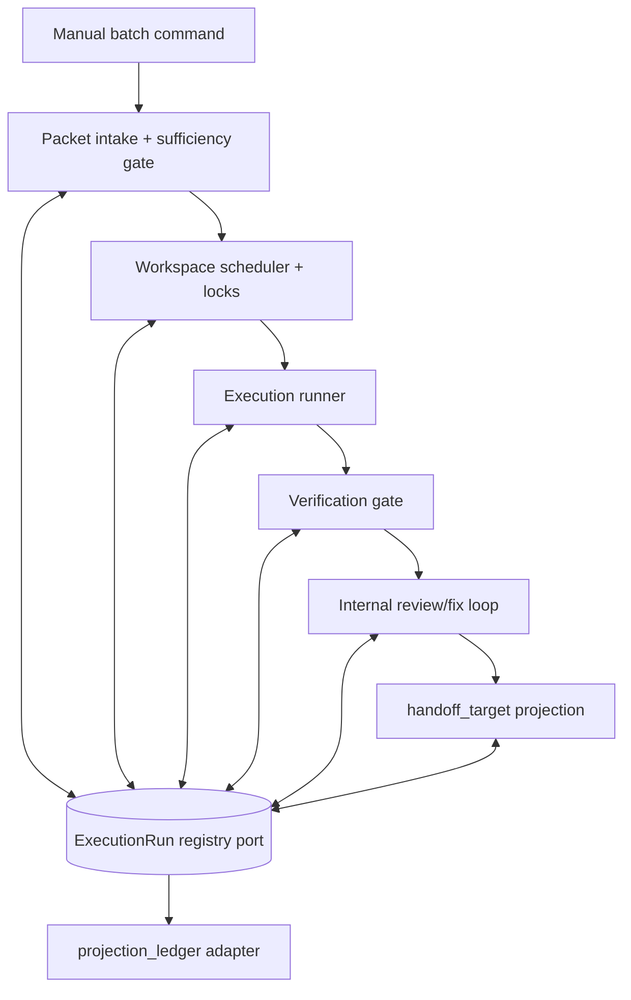

# Buran Architecture

## Selected direction

`buran` is a narrow, purpose-built execution plugin for moving already prepared and approved `work_item`s through manual batches.

It owns provider-neutral execution state through injected storage and projection ports, runs implementation/verification/review loops in isolated workspaces, marks a run ready for `handoff_target` projection only after local gates pass, records the handoff in a `projection_ledger`, and then stops at `Ready for Manual Review`. The current OpenClaw/GitHub path is an adapter/profile, not core language.

## Artifact map

- `ARCHITECTURE.md` — selected architecture contract, decision, C4, boundaries, and binding rules.
- `CONTEXT.md` — local ownership and placement rules for this plugin folder.
- `docs/context-map.md` — upstream/downstream boundaries, handoff points, and side-effect map.
- `docs/module-map.md` — source-tree responsibilities and runtime flow by module.
- `docs/state-machine.md` — execution lifecycle and gate transitions.
- `docs/execution-run-schema.md` — provider-neutral run registry contract plus current JSON storage adapter layout, event log, artifact layout, atomicity, and recovery rules.
- `docs/github-projection-contract.md` — provider-neutral SCM handoff/projection ledger rules, with current GitHub adapter/profile notes.
- `docs/acceptance-scenarios.md` — concise scenario-level behavior already covered by tests.
- `docs/migration-plan.md` — migration from legacy/reference queues into this plugin.

## Architecture decision

### Context

The operator needs repeatable execution of manually approved `work_item`s against explicit `scm_target`s without turning the system into planning, intake, dashboarding, or autonomous merge machinery. The existing OpenClaw `plugins/background-worker` and `scripts/github-*queue` surfaces may be useful references for the current adapter/profile, but they are not the target architecture.

### Decision

Build Buran as a provider-neutral `work_item` execution plugin with:

- manual input: approved `work_item` packets only;
- per-run state owned through a registry port; the current storage adapter persists `run.json`, `events.jsonl`, and artifacts;
- local registry state as source of truth;
- SCM/review/tracker surfaces as `projection_ledger` entries only;
- bounded parallelism across 3–4 workspaces;
- locks by workspace, repo checkout, `scm_target`, branch, and conflict surface rather than a global lock;
- hard gates before handoff projection: verification `PASS` and internal review `PASS`;
- terminal handoff: `Ready for Manual Review`, not auto-merge or Done.

### Tradeoffs

- The current JSON storage adapter is simple and inspectable, but requires explicit atomic write and recovery discipline.
- Local-first state avoids remote truth ambiguity, but projection repair must be idempotent.
- Manual prep keeps quality high, but weak packets must block instead of being improvised.
- Workspace-level parallelism improves throughput, but lock conflicts must be conservative.

### Rejected alternatives

- Productizing `plugins/background-worker` as the main solution: rejected because the required shape is narrower and provider-neutral.
- Extending `scripts/github-*queue` as the owner: rejected because queue scripts should remain legacy/reference surfaces for the GitHub profile only.
- Building research/planning/backlog intake into this plugin: rejected because prep happens outside Buran.
- Adding dashboard UI, handoff babysitting, auto-merge, or Done automation: rejected because the plugin stops at manual review.

## Non-goals

- Arbitrary script execution.
- Generic background worker behavior.
- Research, planning, architecture creation, or implementation-packet drafting.
- Backlog intake or prioritization.
- Handoff babysitting after `Ready for Manual Review`.
- Dashboard UI.
- Auto-merge, Done movement, or final approval automation.

Verification and internal review commands are not a loophole for arbitrary script execution. They must be allowed adapters/gates defined by the approved packet and Buran policy.

## Future work_item-level orchestration

Status: research / implementation later, not current behavior.

Current flat fan-out (`Buran run -> many role workers`) does not scale well and burns context when one run spans multiple `work_item`s or slices.

Target model: `Buran run -> work_item agents -> role workers`.

Guidance for later design:

- `work_item`-scoped workspaces by default;
- role-scoped workspaces only when implementations truly compete;
- one `work_item`-level subagent/orchestrator before any DevHarness role fan-out;
- keep state ownership per `work_item`, with explicit recovery/cancellation and workspace lifecycle rules.

Open questions to research before implementation:

- OpenClaw nested subagent limits;
- DevHarness integration boundary;
- recovery/cancellation behavior;
- per-`work_item` state ownership;
- workspace lifecycle;
- observability across `work_item` agents and role workers.

## C4 context

## C4 container

## C4 component/module view

- **Batch interface**: accepts an explicit approved `work_item` packet list and run options. No autonomous discovery.
- **Packet sufficiency gate**: validates that each `work_item` has approved scope, `scm_target`, implementation instructions, verification expectations, and review criteria. Emits `blocked_plan_insufficient` when weak.
- **ExecutionRun registry**: owns `run.json`, append-only `events.jsonl`, and artifacts. It is the canonical state owner.
- **Operator status read model**: `/buran status --run <run_id>` reads only registry snapshots, events, and safe artifact references through the registry port, reports policy/audit/retry/lease/worker summaries plus one `next_safe_action`, and never mutates, recovers, dispatches workers, reclaims leases, reads logs/chat memory, or calls remote providers.
- **Lock manager**: prevents unsafe overlap by workspace, repo checkout, `scm_target`, branch, and declared conflict surface. No global lock.
- **Workspace manager**: prepares and tracks 3–4 isolated workspaces.
- **Implementation runner**: applies the approved packet. It may make implementation decisions only inside the approved envelope.
- **Verification gate**: records test/lint/build/manual check outcomes and blocks handoff projection unless status is `PASS`.
- **Internal review loop**: runs review, records findings, applies fixes, and blocks handoff projection unless status is `PASS`.
- **Handoff coordinator**: projects the configured `handoff_target` only after verification and review pass; `handoff_ready` is the provider-neutral gate-completion state before `ready_for_manual_review`.
- **Projection adapter**: writes provider-specific SCM/tracker/review updates from local state and can repair projections idempotently.

## Domain model and language

Bounded contexts:

1. **work_item** — immutable approved input prepared outside the plugin.
2. **scm_target** — provider-neutral repository/review target identity used for locks and handoff.
3. **ExecutionRun** — local lifecycle owner for one batch/run.
4. **Workspace Lease** — concurrency and conflict ownership.
5. **Gate Result** — verification/review status that controls transitions.
6. **projection_ledger** — provider-specific update intents/results derived from local state.
7. **handoff_target** — configured review destination reached after local gates pass.

Key terms:

- **work_item**: manually reviewed implementation request sufficient to execute without architectural improvisation.
- **scm_target**: provider-neutral source-control/review target such as repository, branch, issue/change id, and conflict identity.
- **ExecutionRun**: durable local record of one `work_item` execution attempt.
- **Artifact**: local evidence produced during implementation, verification, review, or handoff projection.
- **projection_ledger**: local record of provider-specific projection intents/results; remote systems are never the source of truth.
- **handoff_target**: configured review destination for the completed run; the current profile maps this to a GitHub PR.
- **Conflict surface**: declared files, directories, `scm_target`s, branches, or repo areas that make parallel execution unsafe.

## Dependency rule

The core execution state and transition rules must not depend on GitHub, GitLab, TaskFlow, OpenClaw, Codex, Telegram, concrete JSON/filesystem storage, shell command adapters, UI, or legacy queue modules.

Allowed direction:

`interfaces/adapters -> application workflow -> domain state/transition rules`

Outbound integrations are ports:

- `projection_ledger` port for provider-specific SCM/tracker/review updates;
- `handoff_target` projection port;
- workspace/SCM operation port;
- verification command port;
- review command port;
- clock/id/storage port where needed for deterministic tests.

Composition belongs at the plugin boundary. Domain transition rules receive data and return decisions/events; adapters perform effects after the registry records intent or result.

## Binding rules

1. Only manually prepared and approved packets enter execution.
2. If the packet is weak, transition to `blocked_plan_insufficient`; do not invent architecture or scope.
3. Local registry state is authoritative. The current JSON adapter is an implementation detail; remote systems are projections/journals.
4. Every run has `schema_version`, `run.json`, `events.jsonl`, and artifacts.
5. Writes are atomic: temp file, fsync where practical, rename, then event append or snapshot update according to the schema contract.
6. Recovery uses the registry snapshot plus event journal; the current JSON adapter persists these as `run.json` and `events.jsonl`; projection repair is idempotent.
7. Parallelism is allowed for 3–4 workspaces when locks do not conflict.
8. No handoff projection may be emitted until verification is `PASS` and internal review is `PASS`.
9. The plugin stops at `Ready for Manual Review`.
10. Legacy/reference surfaces must not become runtime dependencies unless a later approved migration explicitly wraps them as adapters.

## Durable WorkerTask lifecycle

Implementation-harness work is represented as a registry-owned `WorkerTask` inside the current `ExecutionRun`, not as provider-owned truth. Core owns `WorkerTask`, `WorkerCompletion`, and `CompletionDecision` semantics; the JSON registry persists `worker_tasks.head`, `worker_tasks.history`, and append-only `worker_task.*` events; application orchestration only sequences task creation, dispatch recording, completion ingestion, and accepted-decision checks before outer state transitions.

Adapters may return sanitized evidence and artifact references, but they do not decide run state. A `running -> verification`, `running -> failed_execution`, or `fix_loop -> verification` transition is allowed only after the current worker completion receives an accepted durable completion decision. Raw prompts, transcripts, stdout/stderr, session blobs, and raw completion payloads remain outside public summaries and registry reports.

## WorkerTask lifecycle (#16)

`WorkerTask` is a first-class durable sub-lifecycle under `ExecutionRun`. The local registry remains the source of truth: implementation and fix-loop dispatches create a worker task, record dispatch evidence, ingest a sanitized worker completion, and persist a `CompletionDecision` before any outer run transition. Adapters provide evidence only; they do not accept their own completion as final truth. Duplicate completions are idempotent, late/unknown/conflicting completions do not advance the run, and public reporting exposes only a sanitized `WorkerTaskSummary`. This does not add an autonomous loop, workflow engine, UI, GitHub transport behavior, or operator control plane.
