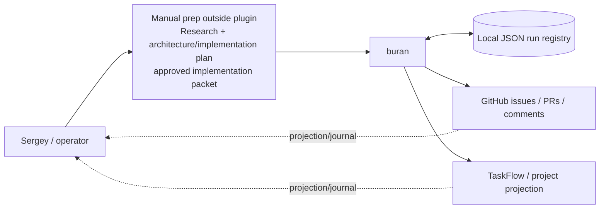
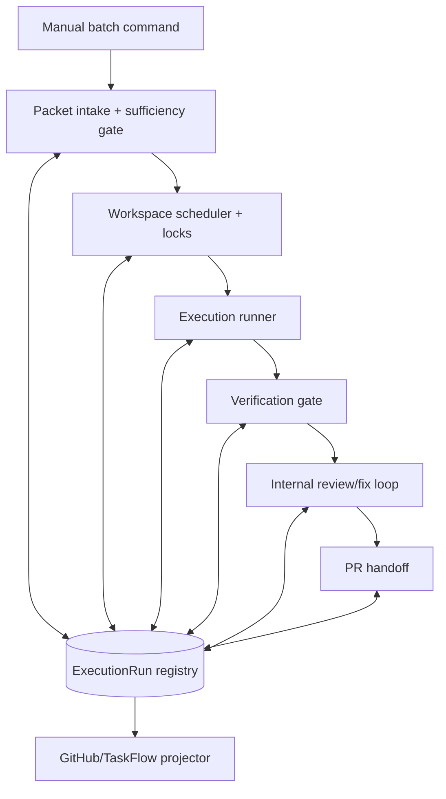

# Buran Architecture

## Selected direction

`buran` is a narrow, purpose-built OpenClaw plugin for executing already prepared and approved GitHub implementation tasks in manual batches.

It owns local execution state as JSON, runs implementation/verification/review loops in isolated workspaces, marks a run ready for PR only after local gates pass, opens/updates the PR as the next explicit handoff step, and then stops at `Ready for Manual Review`.

## Artifact map

- `ARCHITECTURE.md` — selected architecture contract, decision, C4, boundaries, and binding rules.
- `CONTEXT.md` — local ownership and placement rules for this plugin folder.
- `docs/state-machine.md` — execution lifecycle and gate transitions.
- `docs/execution-run-schema.md` — JSON-first run registry, event log, artifact layout, atomicity, and recovery contract.
- `docs/github-projection-contract.md` — GitHub/TaskFlow/comments/project projection rules.
- `docs/migration-plan.md` — migration from legacy/reference queues into this plugin.

## Architecture decision

### Context

Sergey needs repeatable execution of manually approved GitHub tasks without turning the system into planning, intake, dashboarding, or autonomous merge machinery. The existing `plugins/background-worker` and `scripts/github-*queue` surfaces may be useful references, but they are not the target architecture.

### Decision

Build Buran as a local JSON-first task execution plugin with:

- manual input: approved implementation packets only;
- per-run state: `run.json`, `events.jsonl`, and artifacts;
- local state as source of truth;
- GitHub, TaskFlow, comments, labels, and project fields as projections/journals only;
- bounded parallelism across 3–4 workspaces;
- locks by workspace, repo, issue, branch, and conflict surface rather than a global lock;
- hard gates before PR creation: verification `PASS` and internal review `PASS`;
- terminal handoff: `Ready for Manual Review`, not auto-merge or Done.

### Tradeoffs

- JSON files are simpler and inspectable, but require explicit atomic write and recovery discipline.
- Local-first state avoids remote truth ambiguity, but projection repair must be idempotent.
- Manual prep keeps quality high, but weak packets must block instead of being improvised.
- Workspace-level parallelism improves throughput, but lock conflicts must be conservative.

### Rejected alternatives

- Productizing `plugins/background-worker` as the main solution: rejected because the required shape is narrower and task-specific.
- Extending `scripts/github-*queue` as the owner: rejected because queue scripts should remain legacy/reference surfaces.
- Building research/planning/backlog intake into this plugin: rejected because prep happens outside Buran.
- Adding dashboard UI, PR babysitting, auto-merge, or Done automation: rejected because the plugin stops at manual review.

## Non-goals

- Arbitrary script execution.
- Generic background worker behavior.
- Research, planning, architecture creation, or implementation-packet drafting.
- Backlog intake or prioritization.
- PR babysitting after handoff.
- Dashboard UI.
- Auto-merge, Done movement, or final approval automation.

Verification and internal review commands are not a loophole for arbitrary script execution. They must be allowed adapters/gates defined by the approved packet and Buran policy.

## C4 context

## C4 container

## C4 component/module view

- **Batch interface**: accepts an explicit approved packet list and run options. No autonomous task discovery.
- **Packet sufficiency gate**: validates that each task has approved scope, branch/issue target, implementation instructions, verification expectations, and review criteria. Emits `blocked_plan_insufficient` when weak.
- **ExecutionRun registry**: owns `run.json`, append-only `events.jsonl`, and artifacts. It is the canonical state owner.
- **Lock manager**: prevents unsafe overlap by workspace, repo, issue, branch, and declared conflict surface. No global lock.
- **Workspace manager**: prepares and tracks 3–4 isolated workspaces.
- **Implementation runner**: applies the approved packet. It may make implementation decisions only inside the approved envelope.
- **Verification gate**: records test/lint/build/manual check outcomes and blocks PR creation unless status is `PASS`.
- **Internal review loop**: runs review, records findings, applies fixes, and blocks PR creation unless status is `PASS`.
- **PR creator**: opens/updates PR only after verification and review pass; the prior ready-for-PR state means gate completion, not that a PR already exists.
- **Projection adapter**: writes GitHub/TaskFlow/comments/project updates from local state and can repair projections idempotently.

## Domain model and language

Bounded contexts:

1. **Approved Packet** — immutable input prepared outside the plugin.
2. **ExecutionRun** — local lifecycle owner for one batch/run.
3. **Workspace Lease** — concurrency and conflict ownership.
4. **Gate Result** — verification/review status that controls transitions.
5. **Projection Journal** — remote updates derived from local state.

Key terms:

- **Approved implementation packet**: manually reviewed task instructions that are sufficient to execute without architectural improvisation.
- **ExecutionRun**: durable local JSON record of one task execution attempt.
- **Artifact**: local file produced during implementation, verification, review, or PR creation.
- **Projection**: remote GitHub/TaskFlow/comment/project state derived from local JSON, never the source of truth.
- **Conflict surface**: declared files, directories, issues, branches, or repo areas that make parallel execution unsafe.

## Dependency rule

The core execution state and transition rules must not depend on GitHub, TaskFlow, shell command adapters, UI, or legacy queue modules.

Allowed direction:

`interfaces/adapters -> application workflow -> domain state/transition rules`

Outbound integrations are ports:

- GitHub issue/comment/PR projection port;
- TaskFlow/project projection port;
- workspace/git operation port;
- verification command port;
- review command port;
- clock/id/file-system port where needed for deterministic tests.

Composition belongs at the plugin boundary. Domain transition rules receive data and return decisions/events; adapters perform effects after the registry records intent or result.

## Binding rules

1. Only manually prepared and approved packets enter execution.
2. If the packet is weak, transition to `blocked_plan_insufficient`; do not invent architecture or scope.
3. Local JSON is authoritative. Remote systems are projections/journals.
4. Every run has `schema_version`, `run.json`, `events.jsonl`, and artifacts.
5. Writes are atomic: temp file, fsync where practical, rename, then event append or snapshot update according to the schema contract.
6. Recovery uses `run.json` plus `events.jsonl`; projection repair is idempotent.
7. Parallelism is allowed for 3–4 workspaces when locks do not conflict.
8. No PR may be opened until verification is `PASS` and internal review is `PASS`.
9. The plugin stops at `Ready for Manual Review`.
10. Legacy/reference surfaces must not become runtime dependencies unless a later approved migration explicitly wraps them as adapters.
