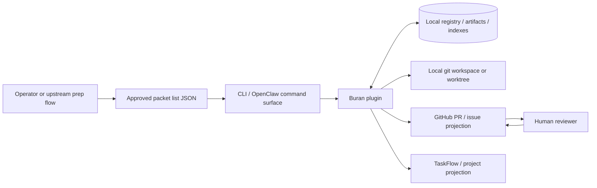

# Context Map

Buran is intentionally narrow. This map shows what the plugin owns, what it consumes, and where it stops.

## System boundary

## Upstream inputs Buran accepts

- approved packet lists passed explicitly to `validate` or `intake`
- local run execution requests passed explicitly to `run`
- explicit workspace lease inputs passed to `lease acquire`
- local registry recovery requests passed to `recover`

Buran does **not** discover work on its own, draft plans, or upgrade weak packets into executable ones.

## Bounded contexts

| Context | Owned by | Buran responsibility | Not owned by Buran |
| --- | --- | --- | --- |
| Approved packet prep | upstream manual process | read and validate sufficiency only | research, planning, architecture, scope drafting |
| ExecutionRun lifecycle | Buran | state machine, events, artifacts, gates, projections | human approval of new scope |
| Workspace lease and conflict control | Buran | local workspace/repo/issue/branch/conflict-surface locks | global scheduling outside this plugin |
| Verification gate | Buran adapters | run allowlisted local checks, record immutable evidence | arbitrary script execution |
| Internal review gate | Buran adapters + human evidence | record review evidence and enforce gate semantics | deriving verdicts from packet text |
| PR / project projection | Buran adapters | record local intent/result and optionally call a transport seam | merge, babysitting, final human review |

## Lifecycle handoff points

1. **Before intake**: packet approval and task shaping happen outside Buran.
2. **After intake**: Buran owns run state in the local registry.
3. **At `running`**: current code records workspace-preparation and implementation-dispatch handoff artifacts, then stops before worker execution.
4. **At `ready_for_manual_review`**: Buran has recorded PR handoff evidence and stops for human review.

## External effect policy by command

| Command | Local state writes | Local workspace inspection | Remote/network side effects |
| --- | --- | --- | --- |
| `validate` | no | no | no |
| `intake` | yes | no | no |
| `run` in current default slice | yes | yes when workspace data is provided | no by default |
| `lease acquire` / `lease release` | yes | no | no |
| `recover` | yes | no | no |
| transport-backed PR projection adapter | yes | no | optional, only through the injected adapter seam |

## Source anchors

- architecture boundary: `ARCHITECTURE.md`
- ownership and placement rules: `CONTEXT.md`
- lifecycle rules: `docs/state-machine.md`
- registry contract: `docs/execution-run-schema.md`
- projection semantics: `docs/github-projection-contract.md`
- runtime orchestration entrypoint: `src/runner.js`
