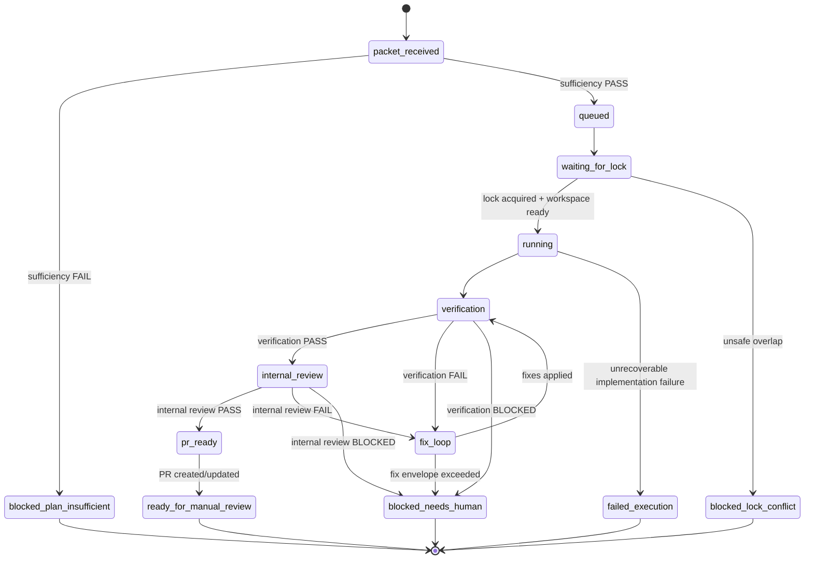

# Execution State Machine

Buran executes only approved implementation packets. State is local-first: each transition is recorded in `events.jsonl` and reflected in `run.json`.

`pr_ready` means ready-for-PR creation/update: verification and internal review have passed, but PR creation has not happened yet. The PR exists only after the `pr_ready` -> `ready_for_manual_review` transition records the handoff.

Gate-bearing states are epoch-aware in `execution-run.v2`: entering `verification` from `running` or `fix_loop` increments `execution.current_epoch` and resets both gate heads to `PENDING` for the new epoch.

## States

## Implementation contract

Slice 2 plus the Slice 3A gate/artifact ledger foundation implement these states through one transition engine. All local code that changes `ExecutionRun.state` must call the engine instead of assigning state ad hoc.

Engine rules:

- transitions are validated against the documented table below;
- unknown states are rejected;
- terminal states cannot transition further;
- invalid transition errors include the attempted edge and allowed destinations;
- each accepted transition appends one monotonic `transition` event and updates `run.json` with the same target state;
- recovery replays `events.jsonl` from sequence `1` and rejects non-monotonic or undocumented edges.

## Transition contract

| From | To | Required evidence |
| --- | --- | --- |
| `packet_received` | `queued` | Approved packet has issue/repo, branch plan, implementation instructions, verification expectations, review criteria, and conflict surface. |
| `packet_received` | `blocked_plan_insufficient` | Missing or contradictory packet data. Buran must not invent missing architecture/scope. |
| `queued` | `waiting_for_lock` | Run accepted into a manual batch. |
| `waiting_for_lock` | `running` | Workspace lease acquired for workspace, repo, issue, branch, and conflict surface. |
| `waiting_for_lock` | `blocked_lock_conflict` | Another active run owns an overlapping lease. |
| `running` | `verification` | Implementation completed inside the approved packet envelope. |
| `verification` | `internal_review` | Fresh verification gate head for the current epoch is `PASS`. |
| `verification` | `fix_loop` | Fresh verification gate head for the current epoch is `FAIL`, and fixes remain inside approved scope. |
| `verification` | `blocked_needs_human` | Fresh verification gate head for the current epoch is `BLOCKED`, so human/manual intervention is still required. |
| `internal_review` | `pr_ready` | Fresh verification `PASS` plus fresh internal-review `PASS` for the current epoch. |
| `internal_review` | `fix_loop` | Fresh internal-review gate head for the current epoch is `FAIL`, and fixes remain inside approved scope. |
| `internal_review` | `blocked_needs_human` | Fresh internal-review gate head for the current epoch is `BLOCKED`, so human/manual review evidence is still required. |
| `fix_loop` | `blocked_needs_human` | Required fix exceeds the approved packet or needs new architecture/planning. |
| `pr_ready` | `ready_for_manual_review` | PR exists and projection journal records handoff. |

## Gate rules

- PR creation is forbidden unless verification is `PASS` and internal review is `PASS` for the current epoch and current attempts.
- Gate results are recorded through `gate.result_recorded`; same idempotency key plus same payload is a no-op, while same key plus different payload is invalid.
- Verification/internal-review artifacts are recorded through `artifact.recorded` with immutable relative paths and epoch/attempt provenance.
- Gate/artifact writes are rejected in terminal states, wrong phases, foreign epochs, or stale attempts.
- Verification/review commands are allowed adapters/gates defined by the approved packet and Buran policy, not arbitrary script execution.
- `blocked_plan_insufficient` is the correct outcome for weak packets.
- A fix loop may repair implementation mistakes, test failures, or review findings inside approved scope only.
- Any new architecture decision, scope expansion, unclear product behavior, or unsafe conflict requires human return, not local improvisation.

## Concurrency rules

- Target parallelism: 3–4 workspaces.
- There is no global lock.
- Lease keys must include workspace, repo checkout, issue, branch, and declared conflict surface.
- Repo checkout locks are scoped to the reserved workspace path so separate workspaces may hold separate local checkouts for the same repo when issue/branch/conflict-surface keys do not overlap.
- Conservative conflict detection wins over throughput.
- Locks are released only after terminal state or explicit recovery marks the previous lease stale.
- Lease TTL expiry is recovered locally by marking the owning run lease `stale_recovered`, removing local lease records, and reporting the recovery finding; recovery does not silently guess active ownership.

## Terminal states

Terminal states are:

- `blocked_plan_insufficient`
- `blocked_lock_conflict`
- `blocked_needs_human`
- `failed_execution`
- `ready_for_manual_review`

Any attempted transition from one of these states is invalid. Recovery treats terminal runs as index-inactive.

## Event ordering

Each transition appends an event containing:

- `schema_version`;
- `run_id`;
- monotonic `sequence`;
- `timestamp`;
- `state_before` and `state_after`;
- actor/adapter name;
- evidence artifact references;
- projection intent/result references where applicable.

Recovery must reject or quarantine non-monotonic event sequences instead of guessing.

Recovery also rejects unknown non-transition event types. A non-transition event is accepted only when its type is on the local whitelist documented in `docs/execution-run-schema.md`, and semantic replay must reject stale/wrong-state gate results, missing artifacts, conflicting gate-result idempotency payloads, or snapshot/ledger mismatches.
