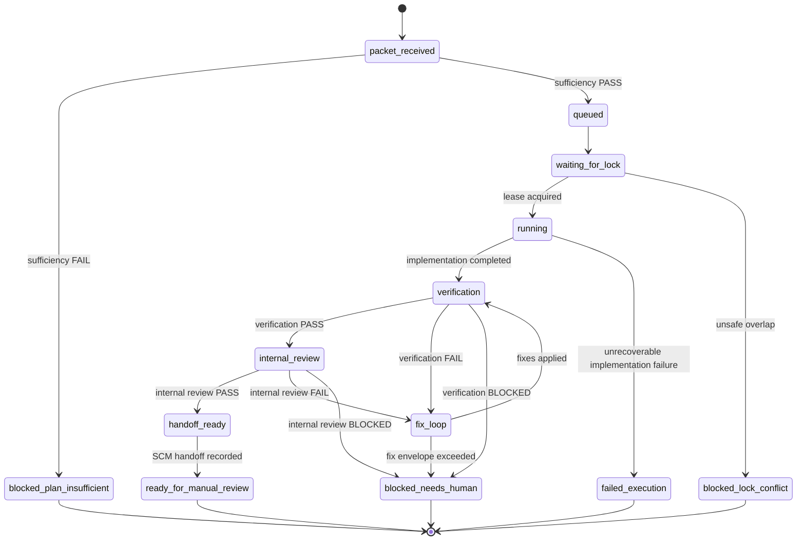

# Execution State Machine

Buran executes approved packets through the canonical state machine in `src/core/modules/execution-runs/`. Runtime, storage, recovery, and tests import that core authority rather than the deprecated `src/execution-runs/*` compatibility re-exports.

## States

## Transition contract

| From | To | Required evidence |
| --- | --- | --- |
| `<start>` | `packet_received` | Approved packet received. |
| `packet_received` | `queued` | Packet sufficiency passed. |
| `packet_received` | `blocked_plan_insufficient` | Packet sufficiency failed. |
| `queued` | `waiting_for_lock` | Accepted into manual batch. |
| `waiting_for_lock` | `running` | Workspace lease acquired. |
| `waiting_for_lock` | `blocked_lock_conflict` | Unsafe lock overlap. |
| `running` | `verification` | Implementation completed. Entering verification creates a fresh gate epoch. |
| `running` | `failed_execution` | Unrecoverable implementation failure. |
| `verification` | `internal_review` | Fresh current-epoch verification gate `PASS`. |
| `verification` | `fix_loop` | Fresh current-epoch verification gate `FAIL`. |
| `verification` | `blocked_needs_human` | Fresh current-epoch verification gate `BLOCKED`. |
| `internal_review` | `handoff_ready` | Fresh current-epoch verification `PASS` and internal-review `PASS`. |
| `internal_review` | `fix_loop` | Fresh current-epoch internal-review `FAIL`. |
| `internal_review` | `blocked_needs_human` | Fresh current-epoch internal-review `BLOCKED`. |
| `fix_loop` | `verification` | Fixes applied inside the approved envelope; entering verification creates a fresh gate epoch. |
| `fix_loop` | `blocked_needs_human` | Fix envelope exceeded or unsupported surface encountered. |
| `handoff_ready` | `ready_for_manual_review` | Successful current-epoch `projection_ledger.handoff_target` result whose `handoff_target` matches the snapshot. |

## Gate and handoff rules

- Terminal states cannot transition further.
- Gate transitions are epoch-aware and require current-attempt evidence.
- `handoff_ready -> ready_for_manual_review` requires a recorded handoff projection result for the current epoch.
- Core handoff vocabulary is provider-neutral. The local default adapter records no network writes; GitHub transport is a concrete integration under `src/integrations/scm/github/` and must be explicitly injected/enabled.
- Recovery replays event journals through the same canonical transition/event rules and quarantines ambiguous state instead of guessing.

## Terminal states

- `blocked_plan_insufficient`
- `blocked_lock_conflict`
- `blocked_needs_human`
- `failed_execution`
- `ready_for_manual_review`
