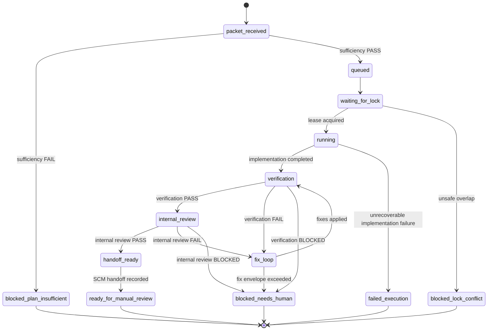

# Execution State Machine

Buran executes approved packets through the canonical state machine in `src/core/modules/execution-runs/`. Runtime, storage, recovery, and tests import that core authority directly.

## States

## Transition contract

| From | To | Required evidence |
| --- | --- | --- |
| `<start>` | `packet_received` | Approved packet received. |
| `packet_received` | `queued` | Packet sufficiency passed. |
| `packet_received` | `blocked_plan_insufficient` | Packet sufficiency failed. |
| `queued` | `waiting_for_lock` | Accepted into manual batch. |
| `waiting_for_lock` | `running` | Workspace lease acquired. |
| `waiting_for_lock` | `blocked_lock_conflict` | Unsafe lock overlap. |
| `running` | `verification` | Implementation completed. Entering verification creates a fresh gate epoch. |
| `running` | `failed_execution` | Unrecoverable implementation failure. |
| `verification` | `internal_review` | Fresh current-epoch verification gate `PASS`. |
| `verification` | `fix_loop` | Fresh current-epoch verification gate `FAIL`. |
| `verification` | `blocked_needs_human` | Fresh current-epoch verification gate `BLOCKED`. |
| `internal_review` | `handoff_ready` | Fresh current-epoch verification `PASS` and internal-review `PASS`. |
| `internal_review` | `fix_loop` | Fresh current-epoch internal-review `FAIL`. |
| `internal_review` | `blocked_needs_human` | Fresh current-epoch internal-review `BLOCKED`. |
| `fix_loop` | `verification` | Fixes applied inside the approved envelope; entering verification creates a fresh gate epoch. |
| `fix_loop` | `blocked_needs_human` | Fix envelope exceeded or unsupported surface encountered. |
| `handoff_ready` | `ready_for_manual_review` | Successful current-epoch `projection_ledger.handoff_target` result whose `handoff_target` matches the snapshot. |

## Gate and handoff rules

- Terminal states cannot transition further.
- Gate transitions are epoch-aware and require current-attempt evidence.
- `handoff_ready -> ready_for_manual_review` requires a recorded handoff projection result for the current epoch.
- Core handoff vocabulary is provider-neutral. The local default adapter records no network writes; GitHub transport is a concrete integration under `src/integrations/scm/github/` and must be explicitly injected/enabled.
- Recovery replays event journals through the same canonical transition/event rules and quarantines ambiguous state instead of guessing.

## Terminal states

- `blocked_plan_insufficient`
- `blocked_lock_conflict`
- `blocked_needs_human`
- `failed_execution`
- `ready_for_manual_review`

## WorkerTask transition guard

Implementation-dispatch, fix-loop, and internal-review worker transitions have an inner durable worker lifecycle. Before `running -> verification`, `running -> failed_execution`, `fix_loop -> verification`, `internal_review -> fix_loop`, or `internal_review -> blocked_needs_human`, the application records a `WorkerTask`, records dispatch evidence, ingests a sanitized terminal `WorkerCompletion`, and requires an accepted `CompletionDecision`. Worker tasks carry explicit purposes/roles: `implementation_dispatch` maps to `implementer`, `fix_attempt` maps to `fixer`, and `review_attempt` maps to `reviewer`. Completion decisions are local registry truth; implementation/review adapters cannot advance the outer state directly.

## Worker completion gate

Implementation dispatch in `running`, fix attempts in `fix_loop`, and review attempts in `internal_review` are gated by the `WorkerTask` sub-lifecycle. The runner records task creation, dispatch evidence, terminal completion evidence, and a durable `CompletionDecision` before requesting an outer transition. `accepted` completion can advance `running -> verification`, `running -> failed_execution`, `fix_loop -> verification`, `internal_review -> fix_loop`, or `internal_review -> blocked_needs_human` according to the existing transition table. Duplicate, late, conflict, unknown, unauthorized, deferred, or rejected decisions remain visible for recovery/operator review and must not advance the run twice or overwrite newer truth. Durable terminology mapping is explicit: completed/failed/blocked/cancelled are accepted `worker_task.completion_decided` events with completion status, timed-out is `worker_task.overdue_recorded`, and late/conflict are `worker_task.completion_decided` events with the corresponding decision. Review verdicts `FAIL` and `BLOCKED` are mapped to core-accepted terminal worker completion statuses before the outer review transition.

Adapter dispatch statuses `PENDING`, `UNKNOWN`, and `STALE` mean wait/reattach, not completion. While one of those statuses is current, `/buran run` keeps the state in `running` or `fix_loop`, preserves `adapter_task_id`/`adapter_status`/heartbeat fields on the active WorkerTask, and reattaches or polls the adapter task instead of recording completion, consuming fix budget, or spawning another worker. If the waiting result lacks an `adapter_task_id`, the recorded result still blocks duplicate spawn and the operator status remains a wait/projection surface until fresh completion evidence arrives. `CANCELLED` is terminal for dispatch and is handled as a non-success completion/blocking result, not as a wait status.

## Operator status projection

`/buran status` does not transition this state machine. It classifies the current snapshot as `active`, `blocked`, `terminal`, `missing`, `corrupt`, or `quarantined` and derives one `next_safe_action` from the current state, lease status, worker-task status, and retry-budget evidence. Expired leases are reported as `expired`/`stale_suspected` only; reclaim remains the recovery command. Retry exhaustion is reported as a blocker and maps to manual review or config repair, but status itself does not append events or move the run to `blocked_needs_human`.
